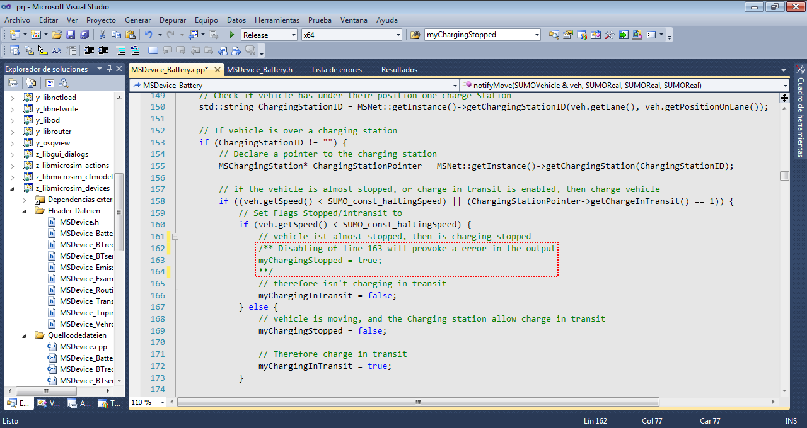
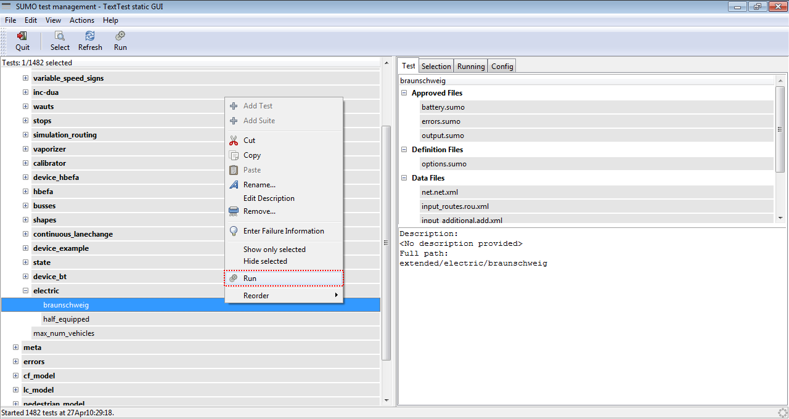
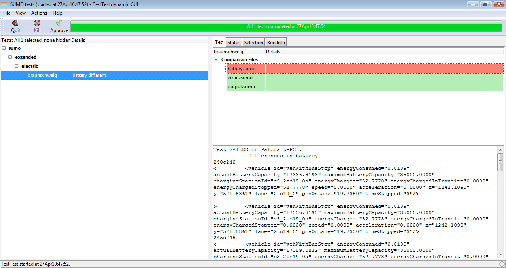
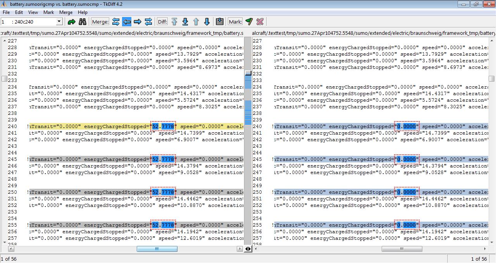
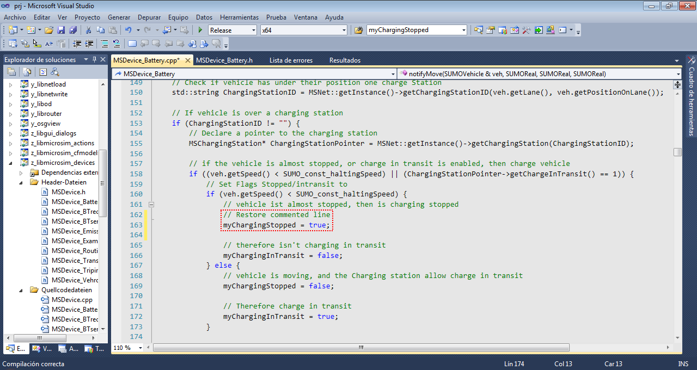
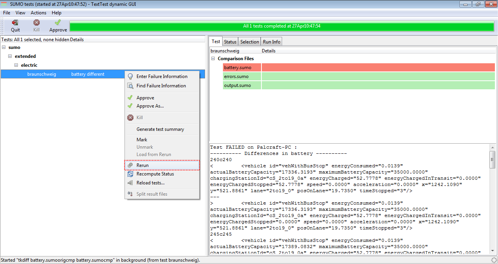
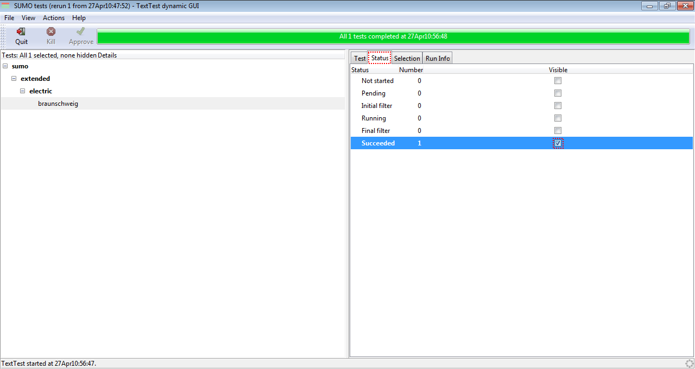
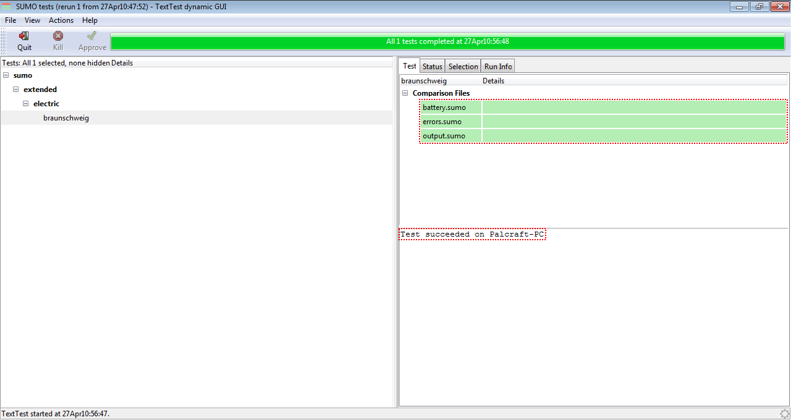

# Introduction

We use [TextTest](http://texttest.org/) to test whether the software
still behaves as expected. TextTest compares an application's file
output, including the output to stdout and stderr with predefined
outputs from files.

There are some advantages and disadvantages of this approach. On the one
hand, you can guarantee that the application is doing what is wanted by
comparing all outputs with files you think are right. But this is also
the problem with this approach: you do not have the assurance that the
files you are comparing the current outputs to *are* right - you have to
prepare them once and update/verify them again every time the expected
results change.

At the moment all our tests run [each night](Nightly_Build.md)
with the results on this [summary webpage](https://sumo.dlr.de/daily/).

# Setup

We use [TextTest](http://texttest.org/) 4.x as our testing environment which
is Python based and currently available for Python 3. To install
it on Linux / MacOS, you can open a terminal and type:

```
pip3 install texttest
```
For Windows you should download and run the installer from the
[SourceForge project page](https://sourceforge.net/projects/texttest/).

It might not pull in all the dependencies, so in some cases you need
to follow the [TextTest installation
instructions](http://texttest.sourceforge.net/index.php?page=documentation_trunk&n=install_texttest)
and the additional info there.

For MacOS the following command should install all dependencies:
   `brew install python py3cairo pygobject3 gtk+3 adwaita-icon-theme`

If the installation was successful, this window will appear after execution of `runAllTests.bat`


## Customize configuration

Common options added to the personal config file
`$HOME/.texttest/config` are the used diff-viewer, editor, and the flag
to collapse the static test suites on program start. E.g.:

```
   diff_program:meld
   view_program:geany
   static_collapse_suites:1
```

# Running the Tests

Within the  `$SUMO_HOME/tests` folder you can find batch files for Windows and shell files for Linux & macOS which start
[TextTest](http://texttest.org/) with our test suites. `runAllTests.bat` (Windows) or `runTests.sh` (Linux, macOS)
starts TextTest for testing all applications located in the folder,
`runNetconvertTests.bat` (Windows) will only show tests for netconvert,
`runDuarouterTests.bat`(Windows) only those for duarouter etc.

# Adding a Test to an existing Application

The easiest method is probably to copy an existing test using the
TextTest GUI context menu functions (copy/paste). Then you can modify
the copied input files, run the test once and save the expected results.
Note, that input files may be picked up along the folder hierarchy so
you may have to copy additional files to your test folder manually if
these inherited input files must be changed as well.

# Adding an Application Test Suite

To add a test suite for a new application, you have to perform the
following steps. For the examples below we'll use "polyconvert" as the
example application.

- go to {{SUMO}}*/tests*
- copy one of the **run...Tests.bat**-files and rename it properly
  (**runPolyconvertTests.bat** in our case); change the name of the
  application within it. In our case the resulting file will look as
  this:

```
call %~dp0\testEnv.bat %1
start %TEXTTESTPY% -a polyconvert
```

- add the application to the list of applications that are tested each
night by
  - adding it to **runTests.sh**; in our case, the following line
    was added:

```
export POLYCONVERT_BINARY="$SUMO_BINDIR/polyconvert"
```

- adding it to **testEnv.bat**; in our case, the following line was added:

```
set POLYCONVERT_BINARY=%~dp0\..\bin\polyconvert%1.exe
```

- build a test folder for the application, named as the application
  itself (without the ".exe" extension), in our case the folder is
  named **polyconvert**
- go the folder
- build a configuration file; its name is "config", the extension is
  the application's to test name, so in our case it's
  **config.polyconvert**. Please consult
  [TextTest](http://texttest.org/) documentation about the content,
  nonetheless, here are some notes
  - do not forget the import of the main config file (config_all)
  - name the binary correct
  - name the file name properly in output
  - In all files that are collated, *Version* should be ignored -
    the tests should be working along all versions

The initial file looks as following:

```
import_config_file:../config_all
binary:$POLYCONVERT_BINARY
copy_test_path:input_net.net.xml
[collate_file]
config:config.cfg
log:log.txt
[run_dependent_text]
output:polyconvert.exe{REPLACE polyconvert}
net:Version
```

- build a top-level testsuite file; its name is "testsuite", the
extension is the application's to test name, so in our case it's
**testsuite.polyconvert**
  - I suppose, it is a good idea to start with tests of meta-output;
    Simply copy them from another application and patch the file
    names...

# Example of use

The main function of existing test is to verify that a modification of a
function does not affect the final output, comparing the output of our
modification in SUMO with a with an previously tested *output control
file*. Note that **SUMO must be compiled in release mode for testing**.
To show an example of use, the *MSDevice_Battery.cpp* file will be
modified to include an error in the output file *battery.xml*. Once
modified the line, run executable *runSumoTests.bat* and find the test
*sumo/extended/electric/braunschweig*, and then right click to run the
test


Manual error


Running test

After execution can be observed that the *battery.sumo* file is marked
in red. That means that the execution of our SUMO modification generated
a different battery output than expected. If the file marked in red was
*errors.sumo*, it means that our modification of SUMO has caused a
*runtime error*, and finally if the file marked in red is *output.sumo*,
it means that SUMO generated some warning during execution.
Double-clicking on the red box *battery.sumo* opens ''TkDiffv
automatically, and displays the differences of our battery output with
respect to the original *battery output control file*.


Error in battery.sumo


Detail of the error comparing both battery.sumo

At this point, we undone the modification in *MSDevice_battery.cpp*
which caused the error, and compile. Once compiled, we will again right
click over the failed text and press *rerun*. A new dialog will be
opened, and then click over *Accept*, and test will be repeated. After
the new test run no error is displayed.


Undo error


Repeating test

After clicking on the check box next to the green message *Succeeded*
can be observed that all output shown in green, and at the bottom appear
a message indicating that the test has been succeeded.


Test succeeded


Details of the test succeeded

# Organization of Tests

Our TextTest tests can be grouped into the categories described below

## Application Tests

These tests are for the executable files in the *bin* folder such as
[netconvert](../netconvert.md), [duarouter](../duarouter.md)
and [sumo](../sumo.md). They work by running their application once
with a predefined set of input files and compare against expected output
files. The tests for sumo run once with the GUI version and once without
GUI..

## Tool Tests

These tests are for the python tools in the *tools* folder such as
[randomTrips.py](../Tools/Trip.md#randomtripspy) and
[flowRouter.py](../Tools/Detector.md#flowrouterpy). Instead of
defining a new application for each tool (as is the standard for
TextTest) they all call the *tests/toolrunner.py* script and select the
actual python tool to test via options. Be aware that the script to use
is always listed last in the options file (this is due to TextTest
trying to reorder options cleverly).

## Complex Tests

These tests go beyond calling an application once. Each tests defines a
*runner.py* script which performs arbitrary application calls. This is
used to call netconvert multiple times to perform back-and-forth format
conversions or to test tutorials where first the network is generated
and afterwards simulation is performed. They are also used for testing
the traci python client (runner.py is a traci script in this case).

## Interactive GUI Tests

These tests are currently only active for [netedit](../Netedit/index.md)
and are described in more detail on the page
[Developer/GUI_Testing](../Developer/GUI_Testing.md).

## Extra Tests

These tests run one or multiple of the test suites above with additional
options or a different python interpreter and are usually not run using
a batch file but the runExtraTests.py. To enable python3 tests you need
to have an executable named python3 in your PATH (which is usually there
on Linux). On Windows you will need to add it by copying the existing
python.exe in your python3 installation to python3.exe (in the same
directory) and adding that directory to the end of your PATH (if it is
not already there).

# Running tests outside TextTest
Different methods to extract TextTest tests (offline and online) are explained [here](../Tutorials/index.md#using_examples_from_the_test_suite).
