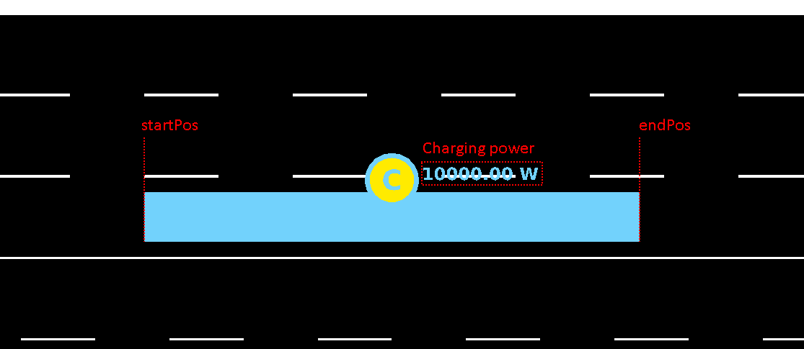
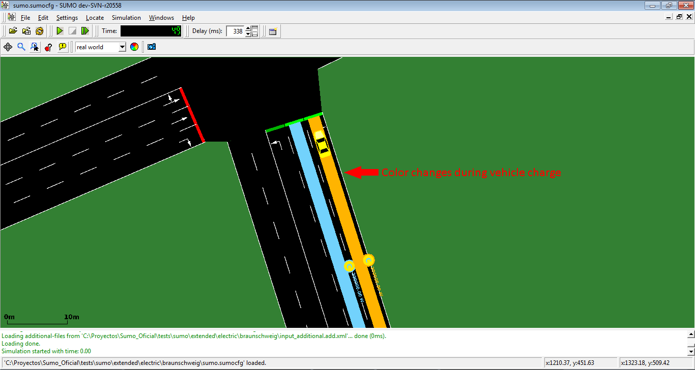

# Overview

Since version 0.24.0 SUMO includes a model for electric vehicles. It was
implemented by Tamás Kurczveil and Pablo Álvarez López from the
[TU-Braunschweig](https://www.tu-braunschweig.de/). The core of the
model is implemented in the [vehicle
device](../Developer/How_To/Device.md) *device.battery*. Additional
features are a charging station (which can be placed on any lane in the
network) and a new output option **--battery-output** {{DT_FILE}}.

You can find a test case for these implementations at
[\[1\]](http://sumo.dlr.de/trac.wsgi/browser/trunk/sumo/tests/sumo/extended/electric/braunschweig)

## Defining Electric Vehicles

To define an electric vehicle, it must be equipped with a battery
device. This may be done using the option **--device.battery.explicit <vehID1,vehID2,...\>** or simply setting **--device.battery.probability 1** to equip
all vehicles. Alternatively, the device may be specified using [Generic
vehicle
parameters](../Definition_of_Vehicles,_Vehicle_Types,_and_Routes.md#devices).

Additional properties of the vehicle and its electrical components must
then be defined via [parameters of the vehicle or its
type](../Simulation/GenericParameters.md).

These values have the following meanings:

| key                     | Value Type | Default    | Description                                             |
| ----------------------- | ---------- | ---------- | ------------------------------------------------------- |
| maximumBatteryCapacity  | float      | 0 (Wh)     | Maximum battery capacity *E<sub>max</sub>*              |
| maximumPower            | float      | 0 (W)      | Maximum power which the vehicle can reach               |
| vehicleMass             | float      | 0 (kg)     | Vehicle mass *m<sub>veh</sub>*                          |
| frontSurfaceArea        | float      | 0 (m2)     | Front surface area *A<sub>veh</sub>*                    |
| airDragCoefficient      | float      | 0          | Air drag coefficient *c<sub>w</sub>*                    |
| internalMomentOfInertia | float      | 0 (kg·m2)  | Mom. of inertia of int. rot. elements *J<sub>int</sub>* |
| radialDragCoefficient   | float      | 0          | Radial drag coefficient c<sub>rad</sub>                 |
| rollDragCoefficient     | float      | 0          | Rolling resistance coefficient *c<sub>roll</sub>*       |
| constantPowerIntake     | float      | 0 (W)      | Avg. (constant) power of consumers *P<sub>const</sub>*  |
| propulsionEfficiency    | float      | 0          | Drive efficiency *η<sub>prop</sub>*                     |
| recuperationEfficiency  | float      | 0          | Recuperation efficiency *η<sub>recup</sub>*             |
| stoppingTreshold        | float      | 0.1 (km/h) | Minimum velocity to start charging                      |

An example of a vehicle with electric attribute:

```
<routes>
    <vType id="ElectricBus" accel="1.0" decel="1.0" lenght="12" maxSpeed="100.0" sigma="0.0" minGap="2.5" color="1,1,1">
        <param key="has.battery.device" value="true"/>
        <param key="maximumBatteryCapacity" value="2000"/>
        <param key="maximumPower" value="1000"/>
        <param key="vehicleMass" value="10000"/>
        <param key="frontSurfaceArea" value="5"/>
        <param key="airDragCoefficient" value="0.6"/>
        <param key="internalMomentOfInertia" value="0.01"/>
        <param key="radialDragCoefficient" value="0.5"/>
        <param key="rollDragCoefficient" value="0.01"/>
        <param key="constantPowerIntake" value="100"/>
        <param key="propulsionEfficiency" value="0.9"/>
        <param key="recuperationEfficiency" value="0.9"/>
        <param key="stoppingTreshold" value="0.1"/>
    </vType>
</routes>
```

The initial energy content of the battery (by default MaxBatKap/2) can
be set in the vehicle definitions

```
<routes>
    <vehicle id="0" type="type1" depart="0" color="1,0,0">
        <param key="actualBatteryCapacity" value="500"/>
    </vehicle>
</routes>
```

## Vehicle behavior

Vehicle behavior will not be affected by battery level. Car will keep driving even when their battery capacity is at 0. To avoid this [TraCI](#traci) must be used to change speed or route based on the current battery level.

## Charging Stations

A charging station is a surface defined on a lane in which the vehicles
equipped with a battery are charged. The basic structure and parameters
of bus stops were used for the implementation of charging stations.

| key                 | Value Type | Value range                                                                                | Default   | Description         |
| ------------------- | ---------- | -------------------------------- | --------- | ----------------------------------------------------------------------------- |
| **id**              | string     | id                                                                                         |           | Charging station ID (Must be unique)                                                                                            |
| **lane**            | string     | valid lane id                                                                              |           | Lane of the charging station location                                                                                           |
| **startPos**        | float      | lane.length < x < lane.length (negative values count backwards from the end of the lane) | 0         | Begin position in the specified lane                                                                                            |
| **endPos**          | float      | lane.length < x < lane.length (negative values count backwards from the end of the lane) |           | End position in the specified lane                                                                                              |
| **power**           | float  (W)    | power \> 0                                                                                 | 0  | Charging power *P<sub>chrg</sub>*                                                                                               |
| **efficiency**      | float      | 0 <= efficiency <= 1                                                                     | 0      | Charging efficiency *η<sub>chrg</sub>*                                                                                          |
| **chargeInTransit** | bool       | 0 or 1                                                                                     | 0         | Enable or disable charge in transit, i.e. vehicle is forced/not forced to stop for charging                                     |
| **chargeDelay**     | float      | chargeDelay \> 0                                                                           | 0         | Time delay after the vehicles have reached / stopped on the charging station, before the energy transfer (charging) is starting |
| name                | string     | simple String                                                                              |           | Charging station name. This is only used for visualization purposes.                                                            |

Charging stations are defined in additional using the following format:

```
<additional>
    <chargingStation chargeDelay="2" chargeInTransit="0" chrgpower="200000" efficiency="0.95" endPos="25" id="cS_2to19_0a" lane="2to19_0" startPos="10"/>
</additional>
```

And are represented in the simulation as shown:


Representation of chargingStation in GUI


Color of chargingStation during charge

### Stopping at a Charging Station

A stop at a charging station may occur due to traffic conditions,
stopping at a defined location or stopping at an explicit
chargingStation as defined below:

```
<routes>
    <vehicle id="v0" route="route0" depart="0">
        <stop chargingStation="myChargingStationID" until="50"/>
    </vehicle>
</routes>
```

### Charging Station output

Option --chargingstations-output "nameOfFile.xml" generates a full
report of energy charged by charging stations:

```
<output>
    <battery-output value="battery.xml"/>
    <chargingstations-output value="chargingstations.xml"/>
</output>
```

File chargingstations.xml has the following structure:

```
<chargingstations-export>
    <chargingStation id="CS1" totalEnergyCharged="71.25" chargingSteps="27">
        <vehicle id="veh0" type="ElectricVehicle1" totalEnergyChargedIntoVehicle="15.83" chargingBegin="12.00" chargingEnd="17.00">
            <step time="12.00" chargingStatus="chargingStopped" energyCharged="2.64" partialCharge="2.64" power="10000.00" efficiency="0.95" actualBatteryCapacity="12962.97" maximumBatteryCapacity="35000.00"/>
            <step time="13.00" chargingStatus="chargingStopped" energyCharged="2.64" partialCharge="5.28" power="10000.00" efficiency="0.95" actualBatteryCapacity="12965.59" maximumBatteryCapacity="35000.00"/>
            <step time="14.00" chargingStatus="chargingStopped" energyCharged="2.64" partialCharge="7.92" power="10000.00" efficiency="0.95" actualBatteryCapacity="12968.22" maximumBatteryCapacity="35000.00"/>
        </vehicle>
        <vehicle id="veh1" type="ElectricVehicle2" totalEnergyChargedIntoVehicle="5.28" chargingBegin="17000" chargingEnd="18000">
            <step time="17.00" chargingStatus="chargingStopped" energyCharged="2.64" partialCharge="18.47" power="10000.00" efficiency="0.95" actualBatteryCapacity="11967.35" maximumBatteryCapacity="35000.00"/>
            <step time="18.00" chargingStatus="chargingStopped" energyCharged="2.64" partialCharge="21.11" power="10000.00" efficiency="0.95" actualBatteryCapacity="12978.72" maximumBatteryCapacity="35000.00"/>
        </vehicle>
        ...
    </chargingStation>
        ...

    ...
</chargingstations-export>
```

For the entire ChargingStation:

| Name               | Type   | Description                                                 |
| ------------------ | ------ | ----------------------------------------------------------- |
| id                 | string | ChargingStation ID                                          |
| totalEnergyCharged | float  | Total energy charged in W during the entire simulation      |
| chargingSteps      | int    | Number of steps in which charginStation was charging energy |

For the current charging vehicle

| Name                          | Type   | Description                                                   |
| ----------------------------- | ------ | ------------------------------------------------------------- |
| id                            | string | ID of vehicle that is charging in these charging stop         |
| type                          | string | type of vehicle                                               |
| totalEnergyChargedIntoVehicle | double | Energy charged during these charging stop                     |
| chargingBegin                 | float  | TimeStep in which vehicle starts with the charge (in seconds) |
| chargingEnd                   | float  | TimeStep in which vehicle ends with the charge (in seconds)   |

For every charging timeStep:

| Name                   | Type   | Description                                                                 |
| ---------------------- | ------ | --------------------------------------------------------------------------- |
| time                   | float  | Current timestep (s)                                                        |
| chargingStatus         | string | Current charging status (Charging, waiting to charge o not charging)        |
| energyCharged          | float  | Energy charged in current timeStep                                          |
| partialCharge          | float  | Energy charged by ChargingStation from begin of simulation to this timeStep |
| power                  | float  | Current power of ChargingStation                                            |
| efficiency             | float  | Current efficiency of ChargingStation                                       |
| actualBatteryCapacity  | string | Current battery capacity of vehicle                                         |
| maximumBatteryCapacity | string | Current maximum battery capacity of vehicle                                 |

## battery-output

There are three output parameters to be set in the SUMO configuration to
use the battery device:

```
<configuration>
    <input>
        <net-file value="netFile.xml"/>
        <route-files value="routeFile.xml"/>
        <additional-files value="additionalFile.xml"/>
    </input>
    <output>
        <battery-output value="Battery.out.xml"/>
        <battery-output.precision value="4"/>
        <device.battery.probability value="1"/>
        <summary-output value="summary_100.xml"/>
    </output>
</configuration>
```

The battery-output generates a file with this structure:

```
<battery-export>
    <timestep time="0.00">
        <vehicle id="vehicle01" Consum="0.00" actualBatteryCapacity="17500.00" maximumBatteryCapacity="35000.00"
            chargingStationId="NULL" energyCharge="0.00" energyChargedInTransit="0.00" energyChargedStopped="0.00"
            speed="12.92" acceleration="0.00" x="1428.27" y="25.57" lane="01to02_0"
            posOnLane="0.00" timeStopped="0"/>
        <vehicle id=..... */
    </timestep>
    <timestep time="1.00">
        <vehicle id=.....
    </timestep>
    <timestep time=...
    ...
    </timestep>
</battery-export>
```

| Name                   | Type   | Description                                                                                                               |
| ---------------------- | ------ | ------------------------------------------------------------------------------------------------------------------------- |
| time                   | int    | Current timestep                                                                                                          |
| id                     | string | id of vehicle                                                                                                             |
| energyConsumed         | double | energy consumption in this timestep in **Wh**                                                                             |
| actualBatteryCapacity  | double | energy content of the battery in this timestep                                                                            |
| maximumBatteryCapacity | double | Max energy capacity of the battery                                                                                        |
| chargingStationId      | string | If vehicle is exactly at a charging station, this value is the id of the charging station, in other case, is NULL         |
| energyCharged          | double | Charge received in the current time step from a charging station (Only \!= 0 if vehicle is exactly at a charging station) |
| energyChargedInTransit | double | Charge that a vehicle in transit received in the current time step from a charging station                                |
| energyChargedStopped   | double | Charge that a stopped vehicle received in the current time step from a charging station                                   |
| speed                  | double | Speed of vehicle in this timestep                                                                                         |
| acceleration           | double | Acceleration of vehicle in this timestep                                                                                  |
| x                      | double | absolute position x of vehicle in the map                                                                                 |
| y                      | double | absolute position y of vehicle in the map                                                                                 |
| lane                   | string | id of the lane that the vehicle is currently on                                                                           |
| posOnLane              | double | Position of vehicle on its current lane                                                                                   |
| timeStopped            | int    | Counter with the number of timesteps that the vehicle has remained standing                                               |

## Emission Output

The [Emission model](../Models/Emissions.md#outputs)-outputs of
SUMO can be used together with the battery device when setting the
`<vType>`-parameter `emissionClass="Energy/unknown"`.

## Tracking fuel consumption for non-electrical vehicles

By setting option **--device.battery.track-fuel**, equipped vehicles will monitor their fuel level based on the fuel consumption of their respective emission class. All capacity values are then interpreted as ml instead of Wh. Also, the chargingStation power is re-interpreted as ml/s when charging fuel.

## TraCI

The internal state of the battery device can be accessed directly using
[*traci.vehicle.getParameter*](../TraCI/Vehicle_Value_Retrieval.md#supported_device_parameters)
and
[*traci.vehicle.setParameter*](../TraCI/Change_Vehicle_State.md#supported_device_parameters).

Furthermore, the function
[*traci.vehicle.getElectricityConsumption()*](../TraCI/Vehicle_Value_Retrieval.md#command_0xa4_get_vehicle_variable)
can be used to access the consumption of the vehicle if the `emissionClass="Energy/unknown"` [is
declared](#emission_output).

### Calculating the remaining Range:

After the vehicle has been driving for a while, the remaining range can be computed based on previous consumption and distance:
```
mWh = traci.vehicle.getDistance(vehID) / float(traci.vehicle.getParameter(vehID, "device.battery.totalEnergyConsumed"))
remainingRange = float(traci.vehicle.getParameter(vehID, "device.battery.actualBatteryCapacity")) * mWh
```
To compute the remaining range on departure, the value of `mWh` (meters per Watt-hour) should be calibrated from a prior simulation.

## Model Details

All information about the implemented device (including details on the
vehicle energy consumption and charging model) can be found in the
following publication.

### Publications

- [Kurczveil, T., López, P.A., Schnieder, E., Implementation of an
Energy Model and a Charging Infrastructure in SUMO. In: Behrisch,
M., Krajzewicz, D., Weber, M. (eds.) Simulation of Urban Mobility.
Lecture Notes in Computer Science, vol. 8594 , pp. 33--43. Springer,
Heidelberg
(2014)](http://elib.dlr.de/93885/1/Proceeding_SUMO2013_15-17May%202013_Berlin-Adlershof.pdf)
