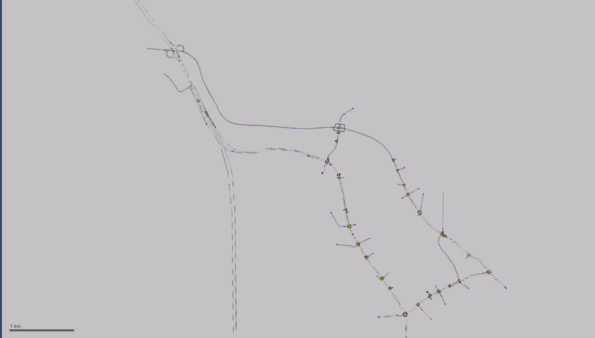
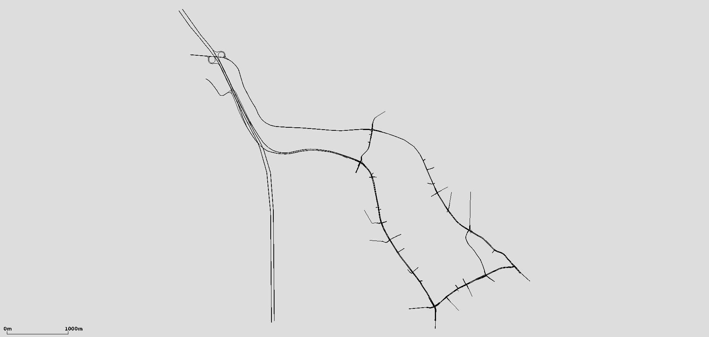
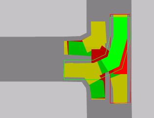
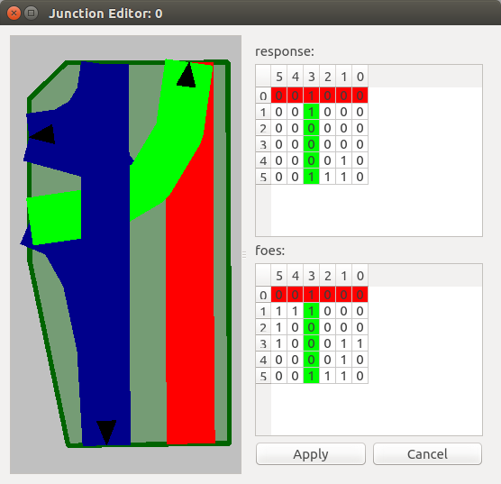
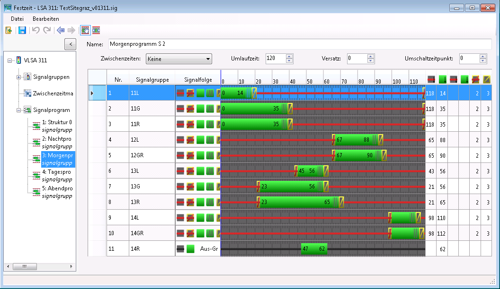
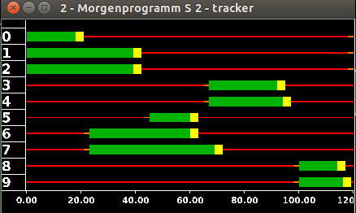

# Extension tools to import features from VISSIM \*.inpx files

!!! caution
    documentation is WORK IN PROGRESS -- more doc to come...

**TODO:**

- translation to english

# Erweiterung der SUMO Netzkonversion

Mit Version 6 der kommerziellen Verkehrsmikrosimulation der Firma PTV,
die nicht nur im deutschsprachigen Raum zur Visualisierung von
Verkehrssachverhalten verwendet wird, wurde das Dateiformat auf ein
XML-basiertes `.inpx-Format` geändert. Da jedoch das SUMO-Tool
`netconvert`, welches zur Konversion von Netzen aus anderen
Quellformaten in ein SUMO-Netz dient bis version 0.23.0 noch auf dem
alten `.inp-Format` basiert, muss eine neuere version verwendet werden
um auch aktuelle Netze im `.inpx-Format` konvertieren zu können. Da sich
außer dem Einlesen der Netzinformationen am Programmablauf nichts
geändert hat, bleibt die Bedienung des/der BenutzerIn von `netconvert`
zur Konversion von VISSIM-Netzen identisch.

Beim Konvertierungsvorgang von .inpx-Netzen werden jedoch zusätzlich die
Priorisierungen innerhalb der SUMO-junctions durch das Einlesen der
Konfliktflächendefinitionen aus VISSIM definiert.

Des Weiteren wurden für das XML-basierte .inpx-Format zusätzliche Python
Tools entwickelt, die nach der Konversion der rohen Netzinformationen
das Einlesen von Routen, Zuflüssen, Lichtsignalanlagen sowie Detektoren
ermöglichen.

## Verwendung

Der Aufruf von `netconvert` für VISSIM-Netze erfolgt über:

```
netconvert --vissim-file=<VISSIM_FILE –-output-file=MySUMOFile.net.xml
```

Die Unterscheidung, ob es sich um ein VISSIM-Netz im neuen `inpx`- oder
alten `inp`-Format handelt wird während der Konversion geprüft. Somit
muss sich der/die BenutzerIn nicht darum kümmern, in welcher Version das
VISSIM-Netz vorliegt. Wollen jedoch außer der reinen Netzkonversion auch
die zusätzlichen Python-Tools zur Konversion weiterer Daten verwendet
werden, so muss das Netz im `.inpx-Format` vorliegen.

## Beispiele

Je nach Komplexität des vorliegenden Netzes kann es notwendig sein, noch
weitere Anpassungen nach der Konversion vornehmen zu müssen. Die
folgenden Abbildungen zeigen eine beispielhafte Konversion eines
`.inpx-Netzes` in ein SUMO-Netz.




Abbildung "Junction conversion" zeigt eine komplexe Kreuzung, welche in
VISSIM erstellt und anschließend in SUMO konvertiert wurde. Die
Abbildung zeigt, dass die Geometrien (und Abbiegerelationen) korrekt
übersetzt werden.


## Priorisierung gemäß VISSIM-Konfliktflächen

Zur Überprüfung der Konversion der Konfliktflächen wurde eine VISSIM
Kreuzung erstellt, die den herkömmlichen Vorrangregeln des
Rechtsverkehrs widerspricht. Anschließend wurde das VISSIM-Netz mittels
`netconvert` in ein SUMO-Netz konvertiert. In den Abbildungen "Conflict
areas" ist zu sehen, dass die Bevorrangung der Linksabbieger gegenüber
den Geradeausfahrern korrekt übersetzt wurden.

**Conflict areas**




Die Daten zur Dargestellten Situation finden sich im Verzeichnis der
Testdaten unter `tests/netconvert/import/leftist_conflictarea-prio/`, wo
sich auch ein entsprechendes `README.md` befindet.

# Konversion der Routen und Zuflüsse

Die Definition von Routen und Zuflüssen sind ein wesentlicher
Bestandteil einer Simulation. Das Python Tool
`convert_vissimXML_flows_statRoutes.py` ermöglicht es, VISSIM-Routen und
-Zuflüsse zu parsen und anhand deren Information eine SUMO-Routendatei
für das konvertierte Netz zu erstellen. Diese hat die Endung `.rou.xml`
und wird bei der Simulation als Argument angegeben. Bei der Konversion
werden **nur statische Routendefinitionen** unterstützt, die eine exakte
Routenabfolge beinhalten. Der Aufruf erfolgt über:

```
convert_vissimXML_flows_statRoutes.py -V <vissim-file> -n <sumo-net-file> -o <output-filename>
```

## Routendefinition VISSIM

Zuflüsse sind in der .inpx-Datei durch den XML-tag
`<timeIntervalVehVolume>` gekennzeichnet. Ein Zufluss ist immer einer
Strecke zugewiesen und durch einen Namen (der auch leer sein kann) und
einer eindeutige ID definiert. Da sich der Fahrzeugzufluss mit der Zeit
ändern kann, werden einem Zufluss Zeitintervalle hinzugefügt, die durch
die Fahrzeugzusammensetzung und die Verkehrsstärke definiert sind. Die
Beginnzeiten der Zeitintervalle sind in Millisekunden angegeben und die
Verkehrsstärke hat die Einheit Fz/h. Eine Zuflussdefinition sieht in
VISSIM wie folgt aus:

```
  <vehicleInput anmFlag="false" link="9" name="Parkplatz 30221" no="1">
     <timeIntVehVols>
        <timeIntervalVehVolume cont="false" timeInt="1 0" vehComp="6" volType="STOCHASTIC" volume="48.000000"/>
        <timeIntervalVehVolume cont="false" timeInt="1 900000" vehComp="6" volType="STOCHASTIC" volume="84.000000"/>
        <timeIntervalVehVolume cont="false" timeInt="1 1800000" vehComp="6" volType="STOCHASTIC" volume="120.040000"/>
        <timeIntervalVehVolume cont="false" timeInt="1 2700000" vehComp="6" volType="STOCHASTIC" volume="120.040000"/>
     </timeIntVehVols>
  </vehicleInput>
```

Routenentscheidungen werden in VISSIM durch ihre Startpunkte
zusammengefasst. Von einer Strecke können mehrere statische Routen
ausgehen, die zu unterschiedlichen Zielstrecken führen. Diese sind durch
das Attribut `destLink` gegeben. Für jede Route werden wie bei den
Zuflüssen Zeitintervalle festgelegt, für welche die relativen Anteile
der Zuflüsse für die Routen definiert sind. Der Verlauf der Route ist
durch die angeführte Streckenfolge gegeben, welche durch den XML-tag
`<linkSeq>` eingeleitet wird. Eine Routendefinition zeigt folgendes
Beispiel:

```
<vehicleRoutingDecisionStatic allVehTypes="true" anmFlag="false" combineStaRoutDec="false" link="9" name="Parkplatz 30221" no="1" pos="1.000000">
     <vehicleRouteStatic destLink="205" destPos="20.916000" name="" no="113" relFlow="2 0:4.000000, 2 900000:6.990000, 2 1800000:9.990000, 2 2700000:9.990000, 2 3600000:12.660000, 2 4500000:16.330000, 2 5400000:20.990000, 2 6300000:15.660000, 2 7200000:16.660000, 2 8100000:16.330000">
        <linkSeq>
           <intObjectRef key="10381"/>
           <intObjectRef key="269"/>
           <intObjectRef key="10154"/>
           <intObjectRef key="117"/>
           <intObjectRef key="10150"/>
           <intObjectRef key="76"/>
           <intObjectRef key="10145"/>
        </linkSeq>
     </vehicleRouteStatic>
  </vehicleRoutingDecisionStatic>
```

## Routendefinition SUMO

In SUMO können definiert werden, bei denen wie in VISSIM mehrere Routen
von einem gemeinsamen Startpunkt zusammengefasst werden. Jede Route in
der Verteilung ist über ihre Streckenabfolge, sowie ihrer
Wahrscheinlichkeit definiert. Die Summe der Wahrscheinlichkeiten aller
Routen muss immer 1 ergeben und die Referenzierung auf eine
Routen-Verteilung erfolgt über deren eindeutige ID:

```
  <routeDistribution id="81_900.0">
     <route edges="81 83 210 211 268 117 76 115 213 212 114 265 203 204 263 109 52 188 297 190 296 186 70 298 238 299 124" id="163" probability="0.372751499001"/>
     <route edges="81 83 210 211 268 117 76 115 213 212 114 265 203 204 263 109 52 188 297 190 296 186 70 298 238 299 239 72 " id="181" probability="0.125916055963"/>
     <route edges="81 83 210 211 268 117 76 115 213 212 114 265 203 204 263 109 52 188 297 190 296 186 181 184" id="187" probability="0.171219187209"/>
     <route edges="81 83 215 216 217 272 16" id="193" probability="0.211192538308"/>
     <route edges="81 83 210 211 268 13" id="195" probability="0.11892071952"/>
  </routeDistribution>
```

Des weiteren gehören zur Routendefinition auch Fahzeugtyp-Verteilungen .
Diese geben die Eigenschaften und die Wahrscheinlichkeit der definierten
Fahrzeugtypen an und müssen vorher definiert werden. Wie bei der
Routen-Verteilung erfolgt die Referenzierung auch hier über die
eindeutige ID:

```
<vTypeDistribution id="6">
   <vType accel="3.500000" id="t1001_D6" length="4.454081632653061" maxSpeed="14.722222222222221" probability="0.900000"/>
   <vType accel="7.300000" id="t1002_D6" length="10.086636363636364" maxSpeed="14.722222222222221" vClass="truck" probability="0.100000"/>
</vTypeDistribution>
```

Auch die Fahrzeugzuflüsse werden in der Routen-Datei definiert. Diese
werden wie in VISSIM für ein gewisses Zeitintervall festgelegt. Wichtig
ist, dass die Zuflüsse **aufsteigend nach der Zeit sortiert** werden, da
diese ansonsten nicht korrekt eingelesen werden können. Jedem Zufluss
wird des Weiteren noch eine zuvor definierte Routen-Verteilung, eine
Fahrzeugtypen-Verteilung sowie eine ID zugeordnet. Zuflüsse werden in
SUMO wie folgt definiert:

```
<flow begin="0.0" color="1,1,0" end="900.0" id="fl81_st0.0" route="81_0.0" type="6" vehsPerHour="94.56"/>
<flow begin="900.0" color="1,1,0" end="1800.0" id="fl81_st900.0" route="81_900.0" type="6" vehsPerHour="120.08"/>
<flow begin="1800.0" color="1,1,0" end="2700.0" id="fl108_st1800.0" route="108_1800.0" type="6" vehsPerHour="161.88"/>
```

Allgemeine Informationen zur Definition von Routen und Zuflüssen finden
sich unter
<http://sumo.dlr.de/docs/Definition_of_Vehicles,_Vehicle_Types,_and_Routes.html>
(zuletzt geprüft am 28.07.2015).

## Umsetzung

Bei der Konversion durch das Tool
`convert_vissimXML_flows_statRoutes.py` werden folgende VISSIM-Attribute
übernommen:

- statische Routenentscheidungen
- Zuflüsse
- Fahrzeugtypen
  - Geschwindigkeit
  - Länge
  - maximale Beschleunigung
  - Fahrzeugzusammensetzung

Da es sich in VISSIM bei Geschwindigkeit, Beschleunigung und Länge um
Wahrscheinlichkeitsverteilungen handelt, müssen aus den Daten erst
Mittelwerte berechnet werden. Des Weiteren ist zu beachten, dass die
Zuflüsse nach der Zeit sortiert werden, um eine korrekte Umsetzung
gewährleisten zu können. Die zeitliche Abfolge muss beim Editieren der
Zuflüsse somit ebenfalls beachtet werden. Durch das Tool wird eine
`.rou.xml` Datei erzeugt, die alle relevanten Routen-Informationen für
die Simulation in SUMO beinhaltet. Diese muss anschließend in die
SUMO-Konfigurationsdatei eingetragen werden.

# Konversion der Lichtsignalprogramme

Das zusätzliche Tool `tls_vissimXML2SUMO.py` ermöglicht es, VISSIM
Lichtsignalanlagen zu parsen und das konvertierte SUMO-Netz mit diesen
Informationen zu erweitern. Der Aufruf erfolgt über:

```
tls_vissimXML2SUMO.py -V <vissim-file> -S <sumo-file> -o <output-filename>
```

## LSA-Definition: VISSIM

In VISSIM wird für jede erstellte Lichtsignalanlage eine zusätzliche
`.sig-Datei` angelegt. Diese beinhaltet alle relevanten Informationen
(wie z.B. Signalsequenz und Signalfolge) zu den definierten
Signalprogrammen einer LSA. Die restlichen Definitionen der LSA befinden
sich in der bestehenden `.inpx-Datei` des zugehörigen Netzes. Folgend
wird an einem Beispiel gezeigt, wie die Struktur dieser Dateien
aussieht.

### .inpx-Datei

In der `.inpx-Datei` sind die Lichtsignalanlagen durch den XML-tag
`<signalController>` gekennzeichnet. Die benötigten Attribute für die
Konversion in das SUMO-Format sind die zugehörige `.sig-Datei` sowie die
Auflistung der definierten Signalgruppen. Signalgruppen können mehreren
Fahrstreifen zugewiesen werden und sind durch eine Signalabfolge
definiert. Diese sind als Attribut des Kindelementes
`<signalOutputConfigurationElement>` vorzufinden. Eine
Lichtsignalanlagen-Definition sieht in VISSIM wie folgt aus:

```
<signalController active="true" cycTm="0.000000" cycTmIsVar="true" debug="false" guiFile="VISSIG_GUI.dll" name="VLSA 301 (WienerStr./JudendorferStr.)" no="301" offset="0.000000" progFile="VISSIG_Controller.dll" progNo="1" scDetRecFile="VISSIM_302.ldp" scDetRecShortNam="false" sigTmsTabAutoConfig="true" supplyFile1="vissig.config" supplyFile2="TestsiteGraz_v01301.sig" supplyFile3="" type="FIXEDTIME">
     <sGs>
        <signalGroup amber="0.000000" greenFlsh="0.000000" minGreen="0.000000" minRed="0.000000" name="11GR" no="1" redAmber="0.000000" type="NORMAL"/>
        < ... >
        <signalGroup amber="0.000000" greenFlsh="0.000000" minGreen="0.000000" minRed="0.000000" name="14R" no="8" redAmber="0.000000" type="NORMAL"/>
     </sGs>
     <wttFiles>
        <intObjectRef key="1"/>
     </wttFiles>
     <sigTmsTabConfig>
        <signalOutputConfigurationElement configName="SIGGRP" detPort="0" sg="301 1" title="" varNo="1" wttFilename="vissim"/>
        <signalOutputConfigurationElement configName="SIGGRP" detPort="0" sg="301 2" title="" varNo="2" wttFilename="vissim"/>
     </sigTmsTabConfig>
  </signalController>
```

In der .inpx-Datei befinden sich ebenfalls die Definitionen der
Lichtsignalgeber aller Lichtsignalanlagen. Diese sind einem Fahrstreifen
einer Strecke zugewiesen und gehören zu einer zuvor definierten
Signalgruppe:

```
<signalHeads>
     <signalHead allPedTypes="true" allVehTypes="true" complRate="1.000000" dischRecAct="false" isBlockSig="false" lane="223 1" localNo="6" name="" no="1" pos="98.115000" sg="305 6" slowDownDist="3.000000" type="CIRCULAR" vAmberBlock="0.000000"/>
     <signalHead allPedTypes="true" allVehTypes="true" complRate="1.000000" dischRecAct="false" isBlockSig="false" lane="276 3" localNo="5" name="" no="2" pos="82.377000" sg="305 5" slowDownDist="3.000000" type="CIRCULAR" vAmberBlock="0.000000"/>
  </signalHeads>
```

### .sig-Datei

Die Signalphasen werden in der `.sig-Datei` über ihre ID referenziert.
Welche ID zu welcher Phase gehört, wird am Anfang der Datei wie folgt
definiert:

```
 <signaldisplays>
     <display id="1" name="Red" state="RED"/>
     <display id="2" name="Red/Amber" state="REDAMBER"/>
  </signaldisplays></source>
```

</source>

Des Weiteren werden in VISSIM für die Definition eines Signalprogrammes
fixe Signalsequenzen verwendet, die ebenfalls am Anfang der `.sig-Datei`
zu finden sind. Diese definieren die Abfolge der Phasen und die
Referenzierung erfolgt über die jeweilige ID:

```
 <signalsequences>
     <signalsequence id="5" name="Red-Red/Amber-Green-Flashing Green-Amber">
        <state display="1" isFixedDuration="false" isClosed="true" defaultDuration="1000" />
        <state display="2" isFixedDuration="true" isClosed="true" defaultDuration="1000" />
        <state display="3" isFixedDuration="false" isClosed="false" defaultDuration="5000" />
        <state display="5" isFixedDuration="true" isClosed="false" defaultDuration="4000" />
        <state display="4" isFixedDuration="true" isClosed="true" defaultDuration="3000" />
     </signalsequence>
     <signalsequence id="12" name="Off-Green">
        <state display="7" isFixedDuration="false" isClosed="true" defaultDuration="1000" />
        <state display="3" isFixedDuration="false" isClosed="false" defaultDuration="5000" />
     </signalsequence>
  </signalsequences>
```

Anschließend erfolgt die Definition aller Signalprogramme und deren
Umlaufzeiten:

```
<prog id="1" cycletime="80000" switchpoint="0" offset="13000" intergreens="0" fitness="0.000000" vehicleCount="0" name="Morgenprogramm S 2.7"/>
```

Die Definition der Signalgruppen besteht aus den Beginnzeiten der Rot-
und Grünphase und den Zeitdauern der restlichen Phasen, welche sich in
der zugehörigen Signalsequenz befinden:

```
<sg sg_id="1" signal_sequence="5">
     <cmds>
        <cmd display="3" begin="13000" />
        <cmd display="1" begin="46000" />
     </cmds>
     <fixedstates>
        <fixedstate display="2" duration="2000" />
        <fixedstate display="5" duration="4000" />
        <fixedstate display="4" duration="3000" />
     </fixedstates>
  </sg>
```

## LSA Definition: SUMO

Im Gegensatz zu VISSIM benötigt SUMO nicht für jede Lichtsignalanlage
eine zusätzliche Datei; es werden die Definitionen aller
Lichtsignalanlagen sowie deren Programme in die bestehende Netzdatei
geschrieben, in der auch alle Graphen-Informationen enthalten sind.
Nachfolgend findet sich die Erklärung einer beispielhaften
LSA-Definition in SUMO.

Eine Lichtsignale ist in der SUMO-Netzdatei durch den XML Element Node
`<tlLogic>` gekennzeichnet. Es können die Attribute `id`, `type`, `offset`
und `programID` vergeben werden, wobei bei der Konversion nur die `id`
und die `programID` definiert werden. Die ID der LSA muss identisch mit
der ID der zugeordneten Kreuzung sein (junction id = tlLogic id) und die
programID beschreibt den Namen des Schaltprogramms. Das Attribut `type`
wird konstant auf “’static”’ gesetzt, was bedeuted, dass die Phasen eine
fixe Zeitdauer aufweisen. Der zeitliche Versatz der LSA, welcher durch
das Attribut `offset` festgelegt ist, wird ebenfalls konstant auf 0.00
gesetzt. Als Kindelemente finden sich die einzelnen Phasen der
Schaltung, welche durch eine Zeitspanne in Sekunden und einen Zustand
gekennzeichnet sind. Jeder Buchstabe des `states` definiert den
aktuellen Zustand eines Fahrstreifens:

```
<tlLogic id="69" type="static" programID="Tagesprogramm S 5.3" offset="0.00">
     <phase duration="20.00" state="Grrr"/>
     <phase duration="20.00" state="yyyy"/>
     <phase duration="100.00" state="rGGG"/>
     <phase duration="100.00" state="yyyy"/>
  </tlLogic>
```

Welcher `state-Index` zu welchem Fahrstreifen zugeordnet wird, ist in
der zugehörigen *Connection* durch deren `linkIndex` definiert.
Zusätzlich muss jede *Connection*, die von einer Lichtsignalanlage
beeinflusst wird, dieser auch zugewiesen werden. Hierfür wird dem
Attribut `tl` die ID der jeweiligen LSA zugeteilt:

```
 <connection dir="r" from="117" fromLane="0" to="88" toLane="0" via=":69_1_0" tl="69" linkIndex="2" state="o"/>
  <connection dir="s" from="117" fromLane="0" to="76" toLane="0" via=":69_2_0" tl="69" linkIndex="3" state="o"/>
  <connection dir="s" from="117" fromLane="1" to="76" toLane="1" via=":69_2_1" tl="69" linkIndex="1" state="o"/>
  <connection dir="r" from="89" fromLane="0" to="76" toLane="0" via=":69_0_0" tl="69" linkIndex="0" state="o"/>
```

Auch die *junction*, auf der die Lichtsignalanlage platziert werden
soll, muss als solche definiert werden. Dies geschieht über das Attribut
`type`, welches die Regelungsart der Kreuzung festlegt. Wird einer
*junction* eine LSA zugewiesen so muss der `type` auf “’traffic_light”’
gesetzt werden:

```
<junction id="69" incLanes="89_0 117_0 117_1" intLanes=":69_0_0 :69_1_0 :69_2_0 :69_2_1" shape="3276.61,1952.22 3277.64,1946.15 3275.74,1944.30 3269.32,1943.27 3265.23,1952.29 3274.96,1953.43" type="traffic_light" x="3273.91" y="1947.87">
     <request cont="0" foes="1100" index="0" response="1100"/>
     <request cont="0" foes="0000" index="1" response="0000"/>
     <request cont="0" foes="0001" index="2" response="0000"/>
     <request cont="0" foes="0001" index="3" response="0000"/>
  </junction>
```

Zusätzlich ist es möglich in SUMO mehrere Programme für eine LSA zu
definieren. Dies geschieht über die Definition einer
Wochenschaltautomatik (kurz WAUT). Durch das Attribut `startProg` wird
festgelegt, welches Programm am Anfang der Simulation ausgewählt werden
soll. Dieses Startprogramm wird aus der VISSIM `.inpx-Datei` übernommen
und die Zuordnung der Signalprogramme geschieht über deren ProgramID.
Während der Simulation können die Signalprogramme entweder in dem GUI
per Hand oder durch das Kindelement `<wautSwitch>` zu einem angegebenen
Zeitpunkt verändert werden:

```
  <WAUT refTime="0" id="myWAUT" startProg="weekday_night">
     <wautSwitch time="21600" to="weekday_day"/>
     <wautSwitch time="79200" to="weekday_night"/>
  </WAUT>
```

Nähere Beschreibungen zur Definition von Lichtsignalanlagen befinden
sich unter <http://sumo.dlr.de/docs/Simulation/Traffic_Lights.html> (zuletzt
geprüft am 28.07.2015).

## Umsetzung

Im Gegensatz zu den anderen Tools müssen hierbei zusätzlich alle `.sig Files` ausgelesen werden, die für jede Lichtsignalanlage automatisch
erzeugt worden sind. Diese müssen sich wie auch von VISSIM verlangt im
selben Ordner wie die `.inpx-Datei` befinden. Nach der Konversion aller
Signalschaltbilder wird die zuvor konvertierte SUMO `.net-Datei` mit den
Informationen der Lichtsignalanlagen ergänzt. Es werden alle
Signalprogramme ausgelesen, zwischen denen über die WAUT gewechselt
werden kann. Das Standardprogramm, welches zu Beginn der Simulation
ausgewählt wird, ist in der `.inpx-Datei` des VISSIM-Netzes definiert
und wird aus dieser übernommen.

## Beispiel




Hier ein Vergleich zweier Signalprogramme über die graphische Oberfläche
von VISSIM und SUMO zu sehen. Die Abbildung zeigt, dass die umgesetzten
Signalgruppen übereinstimmen. Da in VISSIM jedoch der Signalzustand
grün-blinkend existiert, welcher in SUMO nicht definiert ist, musste
dieser bei der Konversion vereinfacht als grün angenommen werden. Des
Weiteren ist zu sehen, dass nicht alle Signalgruppen aus VISSIM bei der
Konversion in SUMO übernommen worden sind. Diese wurden zwar in VISSIM
definiert, jedoch keiner Strecke zugeordnet und somit haben diese keinen
Einfluss auf die Simulation.

# Konversion der Induktionsschleifen und Reisezeitmessungen

Das Python Skript `convert_detectors2SUMO.py` ermöglicht es,
Induktionsschleifen und Reisezeitmessungen aus einem VISSIM-Netz
auszulesen und in das zuvor durch `netconvert` konvertierte SUMO-Netz zu
übernehmen. Bei der Konversion entsteht eine zusätzliches
`.add.xml-Datei`, welche anschließend der SUMO config-Datei für die
Simulation hinzugefügt werden muss. Der Aufruf erfolgt über:

```
convert_detectors2SUMO.py -V <vissim-file> -S <sumo-file> -o <output-filename>
```

## Detektor-Definition VISSIM

Querschnittsmessungen werden in VISSIM durch den XML-tag
`<dataCollectionPoint>` gekennzeichnet. Die Position der einzelnen
Detektoren ist durch den jeweiligen Fahrstreifen der Strecke sowie deren
Laufmeter gegeben:

```
<dataCollectionPoint lane="108 1" name="301.41" no="1" pos="162.558473"/>
<dataCollectionPoint lane="262 4" name="301.12" no="10" pos="32.960054"/>
```

Resezeitmessungen sind in VISSIM nicht fahrstreifen- sondern
streckenbezogen. Hierfür wird die Strecke und der Laufmeter für den
Start- und Endpunkt festgelegt:

```
  <vehicleTravelTimeMeasurement name="Wienerstrasse_Sueden" no="1">
     <start link="207" pos="239.836000"/>
     <end link="126" pos="12.867000"/>
  </vehicleTravelTimeMeasurement>
```

## Detektor-Definition SUMO

Induktionsschleifen werden in SUMO ähnlich definiert wie die
Querschnittsmessungen in VISSIM. Zur Positionierung werden ebenfalls
Fahrstreifen und Laufmeter angegeben. Es ist jedoch zusätzlich möglich
das Zeitintervall zu definieren, in dem die Daten aggregiert werden.

```
  <inductionLoop file="ind_out.xml" freq="900" id="1_301.41" lane="108_0" pos="162.554736186"/>
  <inductionLoop file="ind_out.xml" freq="900" id="33_359.21" lane="123_0" pos="28.1962390136"/>
```

Wie bei den Induktionsschleifen sind auch die Reisezeitmessungen durch
das Zeitintervall der Aggregierung und deren Position definiert. In SUMO
muss sich jedoch im Gegensatz zu VISSIM die Reisezeitmessung nicht auf
die ganze Strecke beziehen, da definiert wird, welche Fahrstreifen
berücksichtigt werden sollen.

```
  <entryExitDetector file="time_out.xml" freq="900" id="1">
     <detEntry lane="207_0" pos="239.753789696"/>
     <detEntry lane="207_1" pos="241.370532161"/>
     <detExit lane="126_0" pos="23.2884507277"/>
     <detExit lane="126_1" pos="23.2873152316"/>
  </entryExitDetector>
```

## Umsetzung

Da bei der Netzkonversion die Verbindungsstrecken aus VISSIM zu
SUMO-*junctions* zusammengefasst werden, bleiben die Streckenlängen
nicht exakt erhalten. Dies hat zur Folge, dass auch die Laufmeterangabe
nicht mehr übereinstimmt. Daher werden die Detektor-Koordinaten in
VISSIM ermittelt und anschließend in SUMO-Koordinaten transformiert. Zur
Ermittlung des Laufmeters in SUMO wird danach der Punkt auf der Strecke
gesucht, der den geringsten Abstand zu den zuvor ermittelten Koordinaten
aufweist.

Ein weiteres Problem bei der Konversion der Reisezeitmessungen ergibt
sich dadurch, dass die Messungen immer für einen geschlossenen Bereich
definiert sein müssen, was in VISSIM nicht der Fall ist. Dadurch ergeben
sich Fehlermeldungen während der Simulation, falls Fahrzeuge den
Endpunkt einer Reisezeitmessung passieren, den Startpunkt jedoch nie
erreicht haben.
